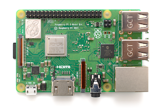
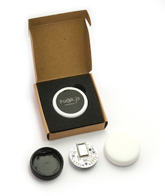
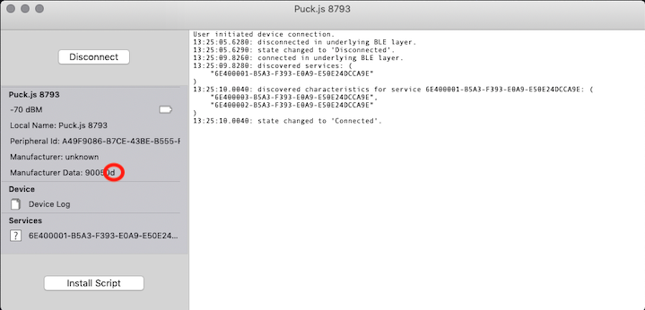
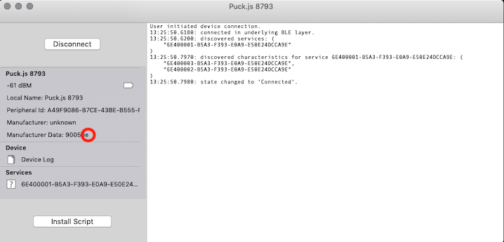
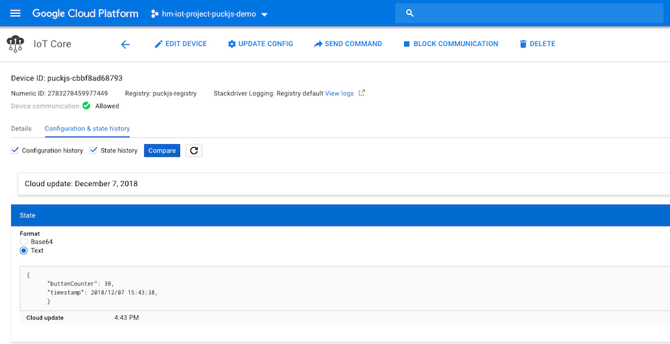

# PuckJS BLE pushbutton to MQTT bridge NodeJS

## Overview

This project is the the gateway part for our [BLE pushbutton with counter]() project.
The gateways responsibility is to listen for Bluetooth LE messages and send them to Google IoT Core. The communication with GCP is similar to our [ESP32 IoT client to connect to Google IoT Core](https://github.com/HiMinds/himinds-iot-project-embedded-esp32-mongoose-gcp-iot-client) project.


The Raspberry Pi is a series of small single-board computers developed in the United Kingdom by the Raspberry Pi Foundation and needs no introduction. We use the Raspberry Pi 3 Model B+ which has BLE support.



We use the Espruino [Puck.js](https://www.espruino.com/Puck.js) which is a BLE smart button with JavaScript support out-of-the-box. Our source code can be found [here](https://github.com/HiMinds/himinds-iot-project-embedded-sensor-pushbutton-ble/tree/master/puckjs-code/src).



With our [code](https://github.com/HiMinds/himinds-iot-project-embedded-sensor-pushbutton-ble/tree/master/puckjs-code/src) in the Puck.js; each time we press the button a byte is incremented in the BLE Advertising message's Manufacturer Data. As shown below if we use a standard BLE scanner:

Before pressing:



After pressing once:



## Prerequisite and installation

We use node version v8.12.0 because it plays better with [Noble](https://www.npmjs.com/package/noble).

```
#  LINUX ONLY - Allow Node.js to access BLE even when it's not running as 'sudo'
sudo setcap cap_net_raw+eip $(eval readlink -f `which node`))
```

[Noble](https://www.npmjs.com/package/noble) requires the following:

```
sudo apt-get install bluetooth bluez libbluetooth-dev libudev-dev
```

## Running the code


```
$ node puckjs-mqtt-bridge.js 

Smart BLE button to MQTT gateway, GCP IoT Core 
/devices/puckjs-cbbf8ad68793/state
projects/hm-iot-project-puckjs-demo/locations/us-central1/registries/puckjs-registry/devices/puckjs-cbbf8ad68793
{ host: 'mqtt.googleapis.com',
  port: 8883,
  clientId: 'projects/hm-iot-project-puckjs-demo/locations/us-central1/registries/puckjs-registry/devices/puckjs-cbbf8ad68793',
  username: 'unused',
  password: '[REMOVED]',
  protocol: 'mqtts',
  secureProtocol: 'TLSv1_2_method' }
Connect to MQTT broker
connected
Starting scan...
Scanning started.
Device  cb:bf:8a:d6:87:93 changed data 23
Device  cb:bf:8a:d6:87:93 changed data 24
Device  cb:bf:8a:d6:87:93 changed data 25
Device  cb:bf:8a:d6:87:93 changed data 27

```

If we look at the data in Google IoT Core it looks like this:





